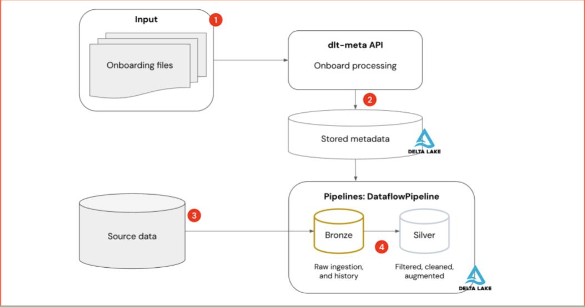
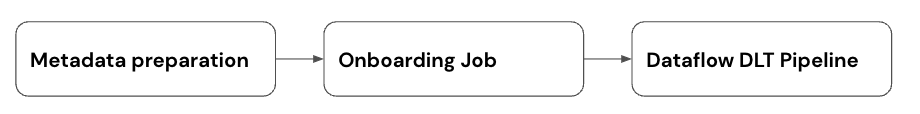

# SDP-META

<!-- Top bar will be removed from PyPi packaged versions -->
<!-- Dont remove: exclude package -->

[Documentation](https://databrickslabs.github.io/dlt-meta/) |
[Release Notes](CHANGELOG.md) |
[Examples](https://github.com/databrickslabs/dlt-meta/tree/main/examples)

<!-- Dont remove: end exclude package -->

---

[](https://databrickslabs.github.io/sdp-meta/) [](https://pypi.org/project/dlt-meta/) [](https://github.com/databrickslabs/dlt-meta/actions/workflows/onpush.yml) [](https://codecov.io/gh/databrickslabs/dlt-meta) [](https://github.com/PyCQA/flake8) [](https://pepy.tech/projects/dlt-meta)

---


# Project Overview
`SDP-META` is a metadata-driven framework designed to work with [Lakeflow Declarative Pipelines](https://www.databricks.com/product/data-engineering/lakeflow-declarative-pipelines). This framework enables the automation of bronze and silver data pipelines by leveraging metadata recorded in an onboarding file (JSON or YAML). This file, known as the Dataflowspec, serves as the data flow specification, detailing the source and target metadata required for the pipelines.

In practice, a single generic pipeline reads the Dataflowspec and uses it to orchestrate and run the necessary data processing workloads. This approach streamlines the development and management of data pipelines, allowing for a more efficient and scalable data processing workflow

[Lakeflow Declarative Pipelines](https://www.databricks.com/product/data-engineering/lakeflow-declarative-pipelines) and `SDP-META`  are designed to complement each other.  [Lakeflow Declarative Pipelines](https://www.databricks.com/product/data-engineering/lakeflow-declarative-pipelines) provide a declarative, intent-driven foundation for building and managing data workflows, while SDP-META adds a powerful configuration-driven layer that automates and scales pipeline creation. By combining these approaches, teams can move beyond manual coding to achieve true enterprise-level agility, governance, and efficiency, templatizing and automating pipelines for any scale of modern data-driven business

### Components:

#### Metadata Interface

- Capture input/output metadata in an onboarding file — JSON ([`examples/json/onboarding.template`](https://github.com/databrickslabs/sdp-meta/blob/main/examples/json/onboarding.template)) or YAML ([`examples/yml/onboarding.yml`](https://github.com/databrickslabs/sdp-meta/blob/main/examples/yml/onboarding.yml))
- Capture Data Quality Rules — JSON ([`examples/json/dqe/customers/bronze_data_quality_expectations.json`](https://github.com/databrickslabs/sdp-meta/blob/main/examples/json/dqe/customers/bronze_data_quality_expectations.json)) or YAML ([`examples/yml/dqe/customers/bronze_data_quality_expectations.yml`](https://github.com/databrickslabs/sdp-meta/blob/main/examples/yml/dqe/customers/bronze_data_quality_expectations.yml))
- Capture processing logic as sql in a Silver transformation file — JSON ([`examples/json/silver_transformations.json`](https://github.com/databrickslabs/sdp-meta/blob/main/examples/json/silver_transformations.json)) or YAML ([`examples/yml/silver_transformations.yml`](https://github.com/databrickslabs/sdp-meta/blob/main/examples/yml/silver_transformations.yml))

#### Generic Lakeflow Declarative Pipeline

- Apply appropriate readers based on input metadata
- Apply data quality rules with Lakeflow Declarative Pipeline expectations
- Apply CDC apply changes if specified in metadata
- Builds Lakeflow Declarative Pipeline graph based on input/output metadata
- Launch Lakeflow Declarative pipeline

## High-Level Process Flow:



## Steps



## SDP-META `Lakeflow Declarative Pipelines` Features support
| Features  | SDP-META Support |
| ------------- | ------------- |
| Input data sources  | Autoloader, Delta, Eventhub, Kafka, snapshot  |
| Medallion architecture layers | Bronze, Silver  |
| Custom transformations | Bronze, Silver layer accepts custom functions|
| Data Quality Expecations Support | Bronze, Silver layer |
| Quarantine table support | Bronze layer |
| [create_auto_cdc_flow](https://docs.databricks.com/aws/en/dlt-ref/dlt-python-ref-apply-changes) API support | Bronze, Silver layer | 
| [create_auto_cdc_from_snapshot_flow](https://docs.databricks.com/aws/en/dlt-ref/dlt-python-ref-apply-changes-from-snapshot) API support | Bronze layer|
| [append_flow](https://docs.databricks.com/en/delta-live-tables/flows.html#use-append-flow-to-write-to-a-streaming-table-from-multiple-source-streams) API support | Bronze layer|
| Liquid cluster support | Bronze, Bronze Quarantine, Silver tables|
| [SDP-META CLI](https://databrickslabs.github.io/sdp-meta/getting_started/sdp_meta_cli/) | Interactive: ```databricks labs sdp-meta onboard```, ```databricks labs sdp-meta deploy```. Bundle-based (see [`DAB_README.md`](DAB_README.md)): ```bundle-init```, ```bundle-prepare-wheel```, ```bundle-add-flow```, ```bundle-validate``` |
| Bronze and Silver pipeline chaining | Deploy sdp-meta pipeline with ```layer=bronze_silver``` option using default publishing mode |
| [create_sink](https://docs.databricks.com/aws/en/dlt-ref/dlt-python-ref-sink) API support |Supported formats:```external delta table , kafka``` Bronze, Silver layers|
| [Declarative Automation Bundles](https://docs.databricks.com/aws/en/dev-tools/bundles/) | First-class: packaged DAB template + four `databricks labs sdp-meta bundle-*` CLI commands (init / prepare-wheel / add-flow / validate), recipes for programmatic flow generation from UC, volumes, Kafka topics or inventory CSVs, and `pipeline_mode={split,combined}` to choose split vs. single Lakeflow Declarative Pipeline. See [`DAB_README.md`](DAB_README.md) for the full reference and [`demo/README.md#dab-demo`](demo/README.md#dab-demo) for an end-to-end runnable walkthrough.
| [SDP-META UI](https://github.com/databrickslabs/sdp-meta/tree/main/lakehouse_app#sdp-meta-lakehouse-app-setup) | Uses Databricks Lakehouse SDP-META App

## Getting Started

Refer to the [Getting Started](https://databrickslabs.github.io/dlt-meta/getting_started) docs for the long form. The short form, in order of recommendation:

1. **Use the [Declarative Automation Bundle](https://docs.databricks.com/aws/en/dev-tools/bundles/) interface** for any real work — `dev`/`prod` targets, git-tracked state, CI/CD-ready. New developers can use `bundle-init --quickstart` to skip every prompt and get a working bundle in one command. This is the recommended path; the interactive `onboard`/`deploy` CLI below is kept for first-touch exploration only.
2. **Use the interactive `onboard` + `deploy` CLI** if you just want to kick the tires against a single workspace.

### Pre-requisites (both paths)

- Python 3.8.0 +
- Databricks CLI v0.213 or later. See [install instructions](https://docs.databricks.com/en/dev-tools/cli/tutorial.html).
  - macOS: 
  - Windows: 
- Authenticate your machine to a workspace:
  ```bash
  databricks auth login --host WORKSPACE_HOST
  ```
  (Add `--debug` to any sdp-meta command to enable debug logs.)
- Install the labs plugin:
  ```bash
  databricks labs install sdp-meta
  ```

### Path A — Declarative Automation Bundle (recommended)

For developer-onramp and any non-exploration use (multi-target promotion, git-tracked pipeline state, CI/CD), scaffold a bundle:

```bash
# Zero-prompt fast path: scaffolds ./my_sdp_meta_pipeline with developer-friendly
# defaults (cloudFiles + bronze_silver + split + pypi). Edit
# resources/variables.yml afterwards to point at your real catalog/schema and
# replace the __SET_ME__ sentinel for sdp_meta_dependency.
databricks labs sdp-meta bundle-init --quickstart

# Or interactive, walking through every knob (recommended the first time):
databricks labs sdp-meta bundle-init

cd <bundle_name>

# Optional, until sdp-meta is on PyPI: build the wheel and upload to a UC volume,
# then paste the printed /Volumes/... path into resources/variables.yml as the
# default for `sdp_meta_dependency`.
databricks labs sdp-meta bundle-prepare-wheel

# Append flows interactively, or in bulk from CSV / generated by recipes
# (see recipes/README.md inside the bundle).
databricks labs sdp-meta bundle-add-flow

# sdp-meta-specific sanity checks (placeholder values in onboarding *and*
# in databricks.yml, layer/topology consistency, wheel_source vs
# sdp_meta_dependency, dataflow_group references) on top of
# `databricks bundle validate`.
databricks labs sdp-meta bundle-validate

# Deploy + run end-to-end.
databricks bundle deploy --target dev
databricks bundle run onboarding --target dev
databricks bundle run pipelines  --target dev
```

What you get with the bundle path:

- **Git-tracked pipeline state** — every onboarding row, expectation, transformation, and pipeline definition lives in YAML/JSON files inside the bundle.
- **`dev` and `prod` targets** out of the box, with development-mode overrides (single-node clusters, no schedules, prefixed table names) and a commented `run_as: { service_principal_name: <your-...> }` block in prod for CI/CD.
- **`pipeline_mode` switch** — render bronze + silver as two separate Lakeflow Declarative Pipelines (`split`, the default) or as a single combined pipeline (`combined`).
- **Recipes** for programmatically generating onboarding entries from real workspace state: `from_uc.py` (existing UC tables), `from_volume.py` (CSVs in a UC volume), `from_topics.py` (Kafka / Event Hub topic lists), `from_inventory.py` (inventory CSV).
- **`bundle-validate` static checks** that catch authoring mistakes the upstream `databricks bundle validate` doesn't (unedited `<your-...>` placeholders in either onboarding or `databricks.yml`, mis-typed `dataflow_group` references, `pipeline_mode` mismatches, sentinel `__SET_ME__` left in place, wheel_source vs sdp_meta_dependency drift, etc.).

Full reference: [`DAB_README.md`](DAB_README.md). Runnable end-to-end walkthrough with sample data: [`demo/README.md#dab-demo`](demo/README.md#dab-demo).

### Path B — Interactive `onboard` + `deploy` CLI (exploration only)

For first-touch exploration against a single workspace. State lives in the workspace, not in git, and there's no native multi-target promotion — graduate to Path A as soon as you want any of those.

If you want to run the existing demo files, set up the repo first:

1. Clone & enter the repo, create a venv, install requirements:
   ```bash
   git clone https://github.com/databrickslabs/sdp-meta.git
   cd sdp-meta
   python -m venv .venv && source .venv/bin/activate
   pip install "PyYAML>=6.0" setuptools databricks-sdk
   pip install delta-spark==3.0.0 pyspark==3.5.5 pytest>=7.0.0 coverage>=7.0.0
   pip install "typer[all]==0.6.1"
   export PYTHONPATH=$(pwd)
   ```
2. Onboard:
   ```bash
   databricks labs sdp-meta onboard
   ```
   

   Pushes code+data to your workspace, creates an onboarding job, and opens the job URL in your browser.

3. Deploy:
   ```bash
   databricks labs sdp-meta deploy
   ```
   

   Deploys the Lakeflow Declarative Pipeline and opens its URL in your browser.

## More questions

Refer to the [FAQ](https://databrickslabs.github.io/dlt-meta/faq)
and SDP-META [documentation](https://databrickslabs.github.io/dlt-meta/)

# Project Support

Please note that all projects released under [`Databricks Labs`](https://www.databricks.com/learn/labs)
are provided for your exploration only, and are not formally supported by Databricks with Service Level Agreements
(SLAs). They are provided AS-IS and we do not make any guarantees of any kind. Please do not submit a support ticket
relating to any issues arising from the use of these projects.

Any issues discovered through the use of this project should be filed as issues on the Github Repo.  
They will be reviewed as time permits, but there are no formal SLAs for support.
