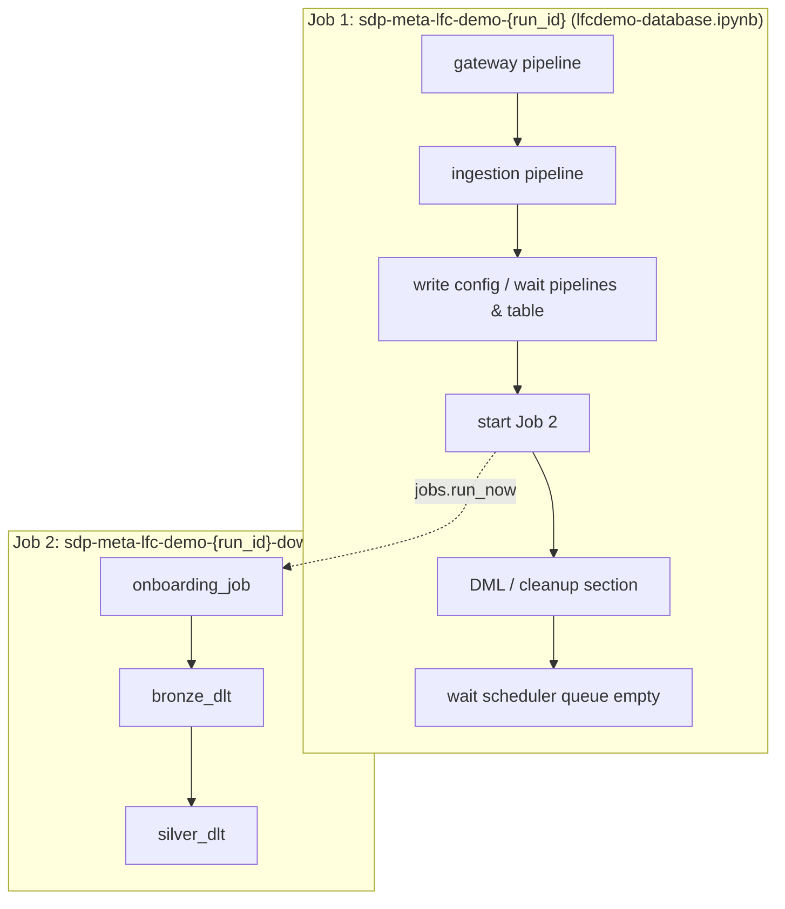

### Lakeflow Connect + DLT-Meta Demo

This demo uses [Lakeflow Connect](https://docs.databricks.com/en/data-governance/lakeflow-connect/index.html) (LFC) to stream two tables — `intpk` and `dtix` — from a source database (SQL Server, PostgreSQL, or MySQL) into Databricks streaming tables, then feeds those directly into a DLT-Meta bronze and silver pipeline. No CSV files or Autoloader are involved; the bronze source is `delta` (streaming table reads).

- **intpk** — LFC SCD Type 1 (primary key: `pk`). LFC overwrites rows in-place; destination has one row per key with inserts/updates/deletes.
- **dtix** — LFC SCD Type 2 (index on `dt`, no primary key). LFC keeps full history; destination has `__START_AT`/`__END_AT` columns. When a source row changes, LFC inserts the new version and marks the previous row inactive by setting `__END_AT`.

When no primary key exists on the source, LFC assumes the entire row is the primary key — see [SCD Type 2 — No Primary Key](#scd-type-2--no-primary-key) below.

---

### LFC SCD Types and DLT-Meta CDC

Both SCD types produce non-append Delta commits (UPDATE/DELETE for SCD1; INSERT + UPDATE for SCD2). A plain `readStream` on either table would fail with "update or delete detected" without additional configuration.

`intpk` uses `readChangeFeed: true` + `bronze_cdc_apply_changes`. `dtix` uses a different approach (`apply_changes_from_snapshot`) — see the note below.

| Table | LFC SCD type | keys | DLT-Meta approach | `scd_type` | Notes |
|-------|-------------|------|-------------------|------------|-------|
| **intpk** | Type 1 | `pk` | `readChangeFeed` + `bronze_cdc_apply_changes` | `"1"` | `apply_as_deletes: _change_type = 'delete'`; `sequence_by`: `_commit_version` (bronze and silver via CDF) |
| **dtix** | Type 2 | `dt, lfc_end_at` | `source_format: snapshot` + `bronze_apply_changes_from_snapshot` + custom `next_snapshot_and_version` lambda (`--snapshot_method=cdf`, default) | `"1"` | DLT reserves `__START_AT`/`__END_AT` globally — renamed inside the lambda; O(1) version-check skips the pipeline when source unchanged; `lfc_end_at` is always unique per row (see note below) |

**`sequence_by` rules.**
- Cannot be blank and must differ from `keys`; it determines which CDF event for the same key is latest.
- Must be a sortable, non-null type. `_commit_version` (from the change data feed) satisfies both — LFC performs the merge at the source, so no source timestamp is needed for bronze ordering.
- For SCD type 2, `__START_AT`/`__END_AT` are typed to match `sequence_by`.
- Multiple-column keys and multi-column `sequence_by` are supported (`struct("ts", "id")` for tie-breaking; in DLT-Meta onboarding use a comma-separated string `"ts,id"`).

**`__START_AT` / `__END_AT` are struct columns, not timestamps.** Each field is an object with two sub-fields:

| Sub-field | Type | Example value |
|-----------|------|---------------|
| `__cdc_internal_value` | string | `"0000132800003360000D-00001328000033600002-00000000000000000001"` |
| `__cdc_timestamp_value` | string (ISO-8601) | `"2026-03-04T01:06:41.787Z"` |

A closed row version in the `dtix` LFC streaming table looks like:

```
dt  │ ...  │ __start_at                                              │ __end_at
────┼──────┼─────────────────────────────────────────────────────────┼────────────────────────────────────────────────────────
42  │ ...  │ { __cdc_internal_value: "0000132800003360000D-...",      │ { __cdc_internal_value: "00001328000033500013-...",
    │      │   __cdc_timestamp_value: "2026-03-04T01:06:41.787Z" }   │   __cdc_timestamp_value: "2026-03-04T01:06:41.363Z" }
```

The active (open) version of the same logical row has `__end_at = NULL`.

Because `__start_at` is a struct, `sequence_by = "__start_at"` compares structs lexicographically — `__cdc_internal_value` encodes a commit position that is lexicographically monotone, so newer row-versions always compare greater. This makes it a safe, non-null sequence key for the silver layer.

**Why `apply_changes` (CDF) cannot be used for `dtix`.** DLT reserves `__START_AT` and `__END_AT` as **system column names** for **all** `APPLY CHANGES` (CDF-based) operations — not just SCD Type 2. Any source that contains columns with these names triggers:

```
DLTAnalysisException: Please rename the following system reserved columns
in your source: __START_AT, __END_AT.
```

This applies even with `scd_type: "1"`. The LFC SCD2 streaming table always has `__START_AT`/`__END_AT` columns, so `apply_changes` simply cannot be used as the source.

**The solution: `apply_changes_from_snapshot` + version-aware `next_snapshot_and_version` lambda.** Two components work together:

1. **Column rename inside the lambda** — `init_sdp_meta_pipeline.py` defines a `dtix_next_snapshot_and_version` function that renames `__START_AT` → `lfc_start_at` and `__END_AT` → `lfc_end_at` at runtime inside the Python lambda, before DLT ever analyses the schema. DLT never sees the reserved names.
2. **`apply_changes_from_snapshot` with a custom lambda** — `dtix` is configured with `source_format: "snapshot"` + `source_details.snapshot_format: "delta"`. DLT-Meta passes the lambda as the snapshot source; `create_auto_cdc_from_snapshot_flow` calls it on each trigger to get the current data, diffs against its internal materialization, and applies changed rows to the target.

**How the lambda works (`--snapshot_method=cdf`, the default):**

```
trigger fires
    │
    ▼
DESCRIBE HISTORY <source_table> LIMIT 1   ← O(1) metadata read
    │
    ├── version == last_processed_version?
    │       └── return None  →  DLT marks run SUCCESS, no data touched  ← O(1) fast skip
    │
    └── version advanced?
            └── spark.read.table(<source>)                 ← O(n) full read
                rename __START_AT → lfc_start_at
                rename __END_AT   → lfc_end_at
                dropDuplicates()
                return (df, current_version)
```

The O(1) fast skip is the key advantage over the built-in view-based path (`--snapshot_method=full`), which always reads the full table regardless of whether anything changed.

> **`--snapshot_method=full` (fallback).** When `--snapshot_method=full` is passed, DLT-Meta creates a DLT view over the source table and uses it directly as the snapshot source (no custom lambda). DLT scans the entire source on **every** trigger — O(n) always. Use this as a stable reference or when the lambda causes issues. For production-scale tables, permanently renaming the LFC reserved columns (outside DLT) so the full CDF path becomes available is the recommended long-term approach.

With `scd_type: "1"` and `keys: ["dt", "lfc_end_at"]`, each unique `(dt, lfc_end_at)` pair identifies a row-version; DLT applies INSERTs, UPDATEs, and DELETEs in-place against those keys. The bronze/silver tables carry `lfc_start_at`/`lfc_end_at` instead of the original LFC column names.

**Why `lfc_end_at` and not `lfc_start_at` as the key.** For no-PK source tables, LFC uses all data columns as the implicit CDC key. If the source has multiple rows with the same `dt` value and all of them are initial-load rows (i.e., LFC has not yet assigned a `__START_AT` CDC timestamp), those rows all have `__START_AT = null` → `lfc_start_at = null`. The key `(dt, lfc_start_at)` is therefore non-unique, causing `APPLY_CHANGES_FROM_SNAPSHOT_ERROR.DUPLICATE_KEY_VIOLATION`.

LFC always assigns a unique `__END_AT.__cdc_internal_value` to every row — including initial-load rows. The internal value encodes a CDC log position plus a per-row sequence number (e.g. `...00000000000000000001`, `...00000000000000000002`, …), making `__END_AT` distinct for every row in the table. `__END_AT` (→ `lfc_end_at`) is `null` only for the single currently-active version of each logical row, and since each logical row has a unique `dt` at any given point in time, `(dt, null)` is also unique.

To verify uniqueness before setting keys:
```sql
-- Should return total == distinct
SELECT COUNT(*) AS total,
       COUNT(DISTINCT struct(dt, __END_AT)) AS distinct_keys
FROM <lfc_source_catalog>.<lfc_schema>.dtix;
```

**DQE and CDC together.** When both `dataQualityExpectations` and `cdcApplyChanges` are set, DLT-Meta runs DQE first (writing passing rows to `<table>_dq`) then CDC from that table to the final target. The demo sets both for `intpk` (SCD1). `dtix` uses `apply_changes_from_snapshot` (no DQE step).

**LFC sets `delta.enableChangeDataFeed = true` by default** on its streaming tables, so `readChangeFeed: true` works without any ALTER step. You cannot change table properties on LFC streaming tables after creation — both `ALTER TABLE ... SET TBLPROPERTIES` and `ALTER STREAMING TABLE ... SET TBLPROPERTIES` are rejected with errors like `SET_TBLPROPERTIES_NOT_ALLOWED_FOR_PIPELINE_TABLE`.

The config is written in two places so they stay in sync:

1. **Launcher** (`demo/launch_lfc_demo.py`) — writes `onboarding.json` to the run's UC Volume.
2. **LFC notebook** (`demo/lfcdemo-database.ipynb`) — overwrites `onboarding.json` with the LFC-created schema after the pipelines are up.

You do **not** pass SCD type on the command line; the demo uses this table-based setup by default.

---

### SCD Type 2 — No Primary Key

When a source table has **no primary key**, Lakeflow Connect automatically uses **all source columns** as the implicit composite primary key and still writes SCD Type 2 history (`__start_at` / `__end_at`). When LFC writes an update, it:

1. **UPDATEs** the old row: sets `__end_at` from `NULL` → timestamp (marks the version as closed).
2. **INSERTs** a new row: new column values, `__start_at` = new timestamp, `__end_at` = `NULL` (new active version).

Because every change produces an UPDATE in the Delta log, `readChangeFeed: true` is required (same as for tables with a PK).

**How to configure DLT-Meta:**

| Setting | Value | Reason |
|---------|-------|--------|
| `keys` | `[all_source_columns] + ["__start_at"]` | Identifies each row **version** uniquely. LFC's implicit PK is all source columns; `__start_at` distinguishes versions of the same logical row. |
| `scd_type` | `"1"` | DLT applies UPDATEs in-place. LFC's `__end_at` is the authoritative history column — setting `scd_type: "2"` would cause DLT to add its own duplicate `__START_AT`/`__END_AT` on top of LFC's columns. |
| `sequence_by` (bronze) | `"_commit_version"` | Always non-null from the change data feed. The UPDATE event that sets `__end_at` always has a higher `_commit_version` than the original INSERT, so the most-recent `__end_at` value wins the merge. Using `__end_at` directly would fail because DLT rejects `NULL` sequence values, and active rows always have `__end_at = NULL`. |
| `sequence_by` (silver) | `"__start_at"` | Always non-null; unique per row-version; monotonically increasing per logical row — equivalent to ordering by "most recent `__end_at`" since newer versions always have a later `__start_at`. |

**Getting the column list from INFORMATION_SCHEMA:**

The notebook queries `INFORMATION_SCHEMA.COLUMNS` (see the SQLAlchemy display cell, line ~85) to get all source column names in ordinal order. The helper `_get_no_pk_scd2_keys(engine, schema, table)` in cell 20 of `lfcdemo-database.ipynb` wraps this query and returns the ordered list used to build the `keys` array:

```python
_src_cols = _get_no_pk_scd2_keys(dml_generator.engine, schema, "my_no_pk_table")
# e.g. ["col_a", "col_b", "col_c"]  — all source columns in ORDINAL_POSITION order
```

**Resulting onboarding config (bronze):**

```json
{
  "bronze_reader_options": { "readChangeFeed": "true" },
  "bronze_cdc_apply_changes": {
    "keys": ["col_a", "col_b", "col_c", "__start_at"],
    "sequence_by": "_commit_version",
    "scd_type": "1",
    "apply_as_deletes": "_change_type = 'delete'",
    "except_column_list": ["_change_type", "_commit_version", "_commit_timestamp"]
  }
}
```

**Resulting onboarding config (silver):**

```json
{
  "silver_cdc_apply_changes": {
    "keys": ["col_a", "col_b", "col_c", "__start_at"],
    "sequence_by": "__start_at",
    "scd_type": "1"
  }
}
```

**In the notebook**, to use the no-PK pattern for any SCD2 table, call the three helpers defined in cell 20 immediately above the `_dtix_cdc` definition:

```python
_src_cols        = _get_no_pk_scd2_keys(dml_generator.engine, schema, "my_table")
_my_table_cdc    = _no_pk_scd2_bronze_cdc(_src_cols)
_my_table_silver = _no_pk_scd2_silver_cdc(_src_cols)
```

For example, to treat `dtix` as a no-PK table (replacing the static `["dt"]` key config), uncomment the three lines shown in cell 20:

```python
_dtix_src_cols   = _get_no_pk_scd2_keys(dml_generator.engine, schema, "dtix")
_dtix_cdc        = _no_pk_scd2_bronze_cdc(_dtix_src_cols)
_dtix_silver_cdc = _no_pk_scd2_silver_cdc(_dtix_src_cols)
```

---

### Prerequisites

1. **Command prompt** – Terminal or PowerShell

2. **Databricks CLI** – Install and authenticate:
   - [Install Databricks CLI](https://docs.databricks.com/dev-tools/cli/index.html)
   - Once you install Databricks CLI, authenticate your current machine to a Databricks Workspace:

   ```commandline
   databricks auth login --host WORKSPACE_HOST
   ```

3. **Python packages**:
   ```commandline
   pip install "PyYAML>=6.0" setuptools databricks-sdk
   ```

4. **Clone dlt-meta**:
   ```commandline
   git clone https://github.com/databrickslabs/dlt-meta.git
   cd dlt-meta
   ```

5. **Set environment**:
   ```commandline
   export PYTHONPATH=$(pwd)
   ```

6. **A Databricks connection** to a source database (SQL Server, PostgreSQL, or MySQL) — see [Lakeflow Connect docs](https://docs.databricks.com/en/data-governance/lakeflow-connect/index.html). The demo uses pre-configured connections:
   - `lfcddemo-azure-sqlserver`
   - `lfcddemo-azure-mysql`
   - `lfcddemo-azure-pg`

---

### Step 1: Run the Demo

The launch script handles everything end-to-end: it uploads the LFC notebook to your workspace and creates a job that runs the LFC setup, onboards DLT-Meta metadata, and starts the bronze + silver pipelines.

```commandline
python demo/launch_lfc_demo.py \
  --uc_catalog_name=<catalog> \
  --connection_name=lfcddemo-azure-sqlserver \
  --cdc_qbc=cdc \
  --trigger_interval_min=5 \
  --snapshot_method=cdf \
  --profile=DEFAULT
```

`--snapshot_method=cdf` is the default; you can omit it or explicitly pass `--snapshot_method=full` to use the built-in full-scan path instead (see [dtix snapshot strategy](#the-solution-apply_changes_from_snapshot--version-aware-next_snapshot_and_version-lambda) above).

To use the **primary key** as the CDC silver `sequence_by` (instead of the `dt` column), add `--sequence_by_pk`:
```commandline
python demo/launch_lfc_demo.py ... --sequence_by_pk
```

**Default: parallel downstream.** The launcher creates two jobs: the setup job (notebook only) and a downstream job (onboarding → bronze → silver). The notebook triggers the downstream job when config and tables are ready, then keeps running (e.g. 1 hour cleanup) until the scheduler queue is empty. To use the single-job flow (lfc_setup → onboarding → bronze → silver) instead:
```commandline
python demo/launch_lfc_demo.py ... --no_parallel_downstream
```

Normally you do **not** pass `--source_schema`; it is read from the **Databricks secret** associated with the connection specified by `connection_name`. Pass it only to override that value.

**Parameters:**

| Parameter | Description | Default / Choices |
|-----------|-------------|-------------------|
| `uc_catalog_name` | Unity Catalog name — required for setup | — |
| `connection_name` | Databricks connection to source DB | `lfcddemo-azure-sqlserver` \| `lfcddemo-azure-mysql` \| `lfcddemo-azure-pg` |
| `source_schema` | *(Optional)* Source schema on the source database (where the `intpk` and `dtix` tables live). When omitted, read from the Databricks secret bound to the connection. | from connection's secret when omitted |
| `cdc_qbc` | LFC pipeline mode | `cdc` \| `qbc` \| `cdc_single_pipeline` |
| `trigger_interval_min` | LFC trigger interval in minutes (positive integer) | `5` |
| `sequence_by_pk` | Use primary key (`pk`) for CDC silver `sequence_by`; if omitted, use `dt` column | `false` (use `dt`) |
| `snapshot_method` | Snapshot strategy for the `dtix` (no-PK SCD2) table. `cdf` = custom `next_snapshot_and_version` lambda with O(1) version check (skips pipeline if nothing changed). `full` = built-in view-based full scan on every trigger. | `cdf` |
| `parallel_downstream` | *(Default on.)* Notebook triggers onboarding → bronze → silver when volume/tables are ready and keeps running until scheduler queue is empty. | on (use `--no_parallel_downstream` to disable) |
| `profile` | Databricks CLI profile | `DEFAULT` |
| `run_id` | Existing `run_id` — presence implies incremental (re-trigger) mode | — |

**Re-triggering bronze/silver** (after initial setup, while the LFC ingestion job is still running):

```commandline
python demo/launch_lfc_demo.py --profile=DEFAULT --run_id=<run_id_from_setup>
```

Alternatively, click **Run now** on the `sdp-meta-lfc-demo-incremental-<run_id>` job in the Databricks Jobs UI — no CLI needed.

---

### What Happens When You Run the Command

**On your laptop (synchronous):**

1. **UC resources created** – Unity Catalog schemas (`sdp_meta_dataflowspecs_lfc_*`, `sdp_meta_bronze_lfc_*`, `sdp_meta_silver_lfc_*`) and a volume are created in your catalog.
2. **Config files uploaded to UC Volume** – `onboarding.json`, `silver_transformations.json`, and DQE configs are uploaded to the volume.
3. **Notebooks uploaded to Workspace** – Runner notebooks are uploaded to `/Users/<you>/sdp_meta_lfc_demo/<run_id>/runners/`.
4. **sdp_meta wheel uploaded** – The `sdp_meta` Python wheel is uploaded to the UC Volume for use by pipeline tasks.
5. **Bronze and silver pipelines created** – Two Lakeflow Declarative Pipelines are created in your workspace.
6. **Job created and started** – A job is created and `run_now` is triggered. The job URL opens in your browser.

**When the job runs on Databricks (asynchronous):**

1. **Metadata onboarded** – The `sdp_meta onboard` step loads metadata into dataflowspec tables from `onboarding.json`, which points to the two LFC streaming tables (`intpk`, `dtix`) as `source_format: delta`.
2. **Bronze pipeline runs** – The bronze pipeline reads from the LFC streaming tables via `spark.readStream.table()` and writes to bronze Delta tables. All rows pass through (no quarantine rules).
3. **Silver pipeline runs** – The silver pipeline applies pass-through transformations (`select *`) from the metadata and writes to silver tables.

**Job flow (parallel downstream, default):** The setup job runs `lfcdemo-database.ipynb`, which creates the LFC gateway and ingestion pipelines, writes config, waits for tables, then **starts Job 2** and keeps running (DML, cleanup, and wait until the scheduler queue is empty). Job 2 runs onboarding → bronze → silver in parallel.



- **Job 1** (single task: notebook): gateway and ingestion pipelines are created; config is written; after pipelines and table are ready, the notebook calls `jobs.run_now(downstream_job_id)` to start **Job 2**, then continues with DML/cleanup and exits only when the scheduler queue is empty.
- **Job 2** (three tasks): runs onboarding → bronze_dlt → silver_dlt; no dependency on Job 1 completing.

---

### Onboarding Configuration

DLT-Meta is configured with `source_format: delta` and points directly at the LFC streaming tables. `<lfc_schema>` is the schema where LFC created the streaming tables (e.g. `main.<user>_sqlserver_<id>`); the notebook overwrites `onboarding.json` with that schema after the pipelines are up.

```json
[
  {
    "data_flow_id": "1",
    "data_flow_group": "A1",
    "source_format": "delta",
    "source_details": {
      "source_catalog_prod": "<catalog>",
      "source_database": "<lfc_schema>",
      "source_table": "intpk"
    },
    "bronze_database_prod": "<catalog>.sdp_meta_bronze_lfc_<run_id>",
    "bronze_table": "intpk",
    "bronze_reader_options": { "readChangeFeed": "true" },
    "bronze_cdc_apply_changes": {
      "keys": ["pk"],
      "sequence_by": "_commit_version",
      "scd_type": "1",
      "apply_as_deletes": "_change_type = 'delete'",
      "except_column_list": ["_change_type", "_commit_version", "_commit_timestamp"]
    },
    "silver_database_prod": "<catalog>.sdp_meta_silver_lfc_<run_id>",
    "silver_table": "intpk",
    "silver_transformation_json_prod": "<volume_path>/conf/silver_transformations.json",
    "silver_reader_options": { "readChangeFeed": "true" },
    "silver_cdc_apply_changes": {
      "keys": ["pk"],
      "sequence_by": "_commit_version",
      "scd_type": "1",
      "apply_as_deletes": "_change_type = 'delete'",
      "except_column_list": ["_change_type", "_commit_version", "_commit_timestamp"]
    }
  },
  {
    "data_flow_id": "2",
    "data_flow_group": "A1",
    "source_format": "snapshot",
    "source_details": {
      "source_catalog_prod": "<catalog>",
      "source_database": "<lfc_schema>",
      "source_table": "dtix",
      "snapshot_format": "delta"
    },
    "bronze_database_prod": "<catalog>.sdp_meta_bronze_lfc_<run_id>",
    "bronze_table": "dtix",
    "bronze_apply_changes_from_snapshot": {
      "keys": ["dt", "lfc_end_at"],
      "scd_type": "1"
    },
    "silver_database_prod": "<catalog>.sdp_meta_silver_lfc_<run_id>",
    "silver_table": "dtix",
    "silver_transformation_json_prod": "<volume_path>/conf/silver_transformations.json",
    "silver_apply_changes_from_snapshot": {
      "keys": ["dt", "lfc_end_at"],
      "scd_type": "1"
    }
  }
]
```

**Silver transformations** (`silver_transformations.json`) — pass-through for both tables:

```json
[
  { "target_table": "intpk", "select_exp": ["*"] },
  { "target_table": "dtix",  "select_exp": ["*"] }
]
```

**DQE** (`bronze_dqe.json`) — all rows pass:

```json
{
  "expect": {
    "valid_row": "true"
  }
}
```

---

### Flow Summary

```
Source DB (SQL Server / PostgreSQL / MySQL)
    |
    v
LFC Gateway + Ingestion  (lfcdemo-database.ipynb)
    |
    v
Streaming tables:  {catalog}.{lfc_schema}.intpk  (SCD Type 1)
                   {catalog}.{lfc_schema}.dtix   (SCD Type 2)
    |
    v  intpk: source_format=delta + readChangeFeed (bronze + silver CDC apply_changes)
    |  dtix:  source_format=snapshot + snapshot_format=delta + next_snapshot_and_version lambda (apply_changes_from_snapshot, default cdf mode)
DLT-Meta Bronze
    |
    v
DLT-Meta Silver
```

---

### References

| Resource | Link |
|----------|------|
| **LFC Database Notebook** | [demo/lfcdemo-database.ipynb](../../../demo/lfcdemo-database.ipynb) |
| **LFC Docs** | [Lakeflow Connect](https://docs.databricks.com/en/data-governance/lakeflow-connect/index.html) |
| **DLT-Meta delta source** | [Metadata Preparation](../getting_started/metadatapreperation.md) |
| **Tech Summit Demo** | [Techsummit.md](Techsummit.md) |

---

### History of what was tried and failed

1. **First failure (MERGE at version 9).** The LFC source table `intpk` is a streaming table that receives CDC data (including UPDATE and DELETE / MERGE). The bronze DLT flow does a streaming read and by default expects an **append-only** source. When the source had a MERGE at version 9, the streaming read failed.

2. **First fix: skipChangeCommits.** We set `bronze_reader_options: {"skipChangeCommits": "true"}` for dtix so the bronze read **skipped** non-append commits instead of failing — but that does **not** merge updates, so `__END_AT` was inaccurate.

3. **Switch to processing CDC; hit reserved-column wall for `dtix`.** For `intpk` we use `readChangeFeed: true` + `bronze_cdc_apply_changes` SCD1 — this works. For `dtix` the same approach fails: DLT **globally** reserves `__START_AT` and `__END_AT` as system column names for **all** `APPLY CHANGES` (CDF-based) operations, not just SCD Type 2. Because the LFC streaming table for `dtix` already has these columns, every attempt — including with `scd_type: "1"` — raised `DLTAnalysisException: system reserved columns __START_AT, __END_AT`.

4. **Fix: `apply_changes_from_snapshot` + column rename for `dtix`.** Since `apply_changes` (CDF) is fundamentally incompatible with sources that have `__START_AT`/`__END_AT`, we switch `dtix` to `source_format: "snapshot"` + `bronze_apply_changes_from_snapshot`. This uses DLT's snapshot-comparison CDC (`create_auto_cdc_from_snapshot_flow`) which reads the full LFC table as a batch on each trigger. Two sub-fixes were also required: (a) a 1-line bug fix in `dataflow_pipeline.py` (the snapshot write-path gate checked `next_snapshot_and_version` but did not account for the `next_snapshot_and_version_from_source_view` flag); (b) `apply_changes_from_snapshot` also strips `__START_AT`/`__END_AT` from the snapshot view (DLT reserves them globally), so we added a `bronze_custom_transform` in `init_sdp_meta_pipeline.py` that renames `__START_AT` → `lfc_start_at` and `__END_AT` → `lfc_end_at` before DLT sees the schema, and updated the keys to `["dt", "lfc_end_at"]`. The key `["dt", "lfc_start_at"]` was tried first but failed with `DUPLICATE_KEY_VIOLATION` on the incremental run because no-PK source tables can have multiple rows with the same `dt` and null `__START_AT`; `__END_AT` is always unique per row (LFC encodes a per-row sequence number in `__cdc_internal_value`), making `(dt, lfc_end_at)` the correct composite key.

5. **Suspicion without checking.** When the DLT (bronze) pipeline update failed again, we **suspected** `delta.enableChangeDataFeed` was false and added an `ALTER TABLE ... SET TBLPROPERTIES` step **without checking** the table property. In reality LFC sets CDF to true by default; the failure was likely something else (table not found, wrong schema, or timing). The ALTER step is not allowed on LFC streaming tables and is unnecessary. The notebook now skips the ALTER when the platform reports that property changes are not allowed and resolves the table location from `lfc_created.json` with a longer wait.

6. **Table existence check: SHOW TBLPROPERTIES vs SELECT.** The notebook used `SHOW TBLPROPERTIES` to decide if the LFC `intpk` table existed. On LFC streaming tables that can fail even when the table is queryable (`SELECT * FROM ...` runs). The existence check was changed to `SELECT 1 FROM <table> LIMIT 0` so the wait loop succeeds as soon as the table can be read.

7. **`DELTA_SOURCE_TABLE_IGNORE_CHANGES` on silver `intpk` (incremental run).** Bronze `intpk` uses `apply_changes` (CDC), which writes MERGEs into the Delta log. On the incremental run the silver streaming read resumed from its checkpoint and hit those MERGE commits, which Delta streaming rejects by default. Fix: `silver_reader_options: {"readChangeFeed": "true"}` is now set for `intpk` silver so it consumes the bronze CDF (which handles MERGE natively). The silver CDC was updated accordingly: `sequence_by: "_commit_version"`, `apply_as_deletes: "_change_type = 'delete'"`, and `except_column_list` to strip the CDF metadata columns from the silver table. Without this fix, the first incremental run always fails.

8. **`apply_changes_from_snapshot` full-scan inefficiency for `dtix` (`--snapshot_method=cdf`).** The built-in view-based snapshot path (`--snapshot_method=full`) reads the entire `dtix` source table on every pipeline trigger — O(n) always. For a slowly-changing table triggered frequently, this is wasteful. The new default (`--snapshot_method=cdf`) supplies a custom `next_snapshot_and_version` lambda that first does an O(1) `DESCRIBE HISTORY LIMIT 1` check. If the source Delta table version has not advanced since the last run, the lambda returns `None` and DLT skips the run entirely (no data read, no diff). Only when the version advances does the lambda do the full read + rename. This required a small enhancement to `dataflow_pipeline.py` (`is_create_view` and `apply_changes_from_snapshot`) to allow the custom lambda to take priority over the built-in view path.
